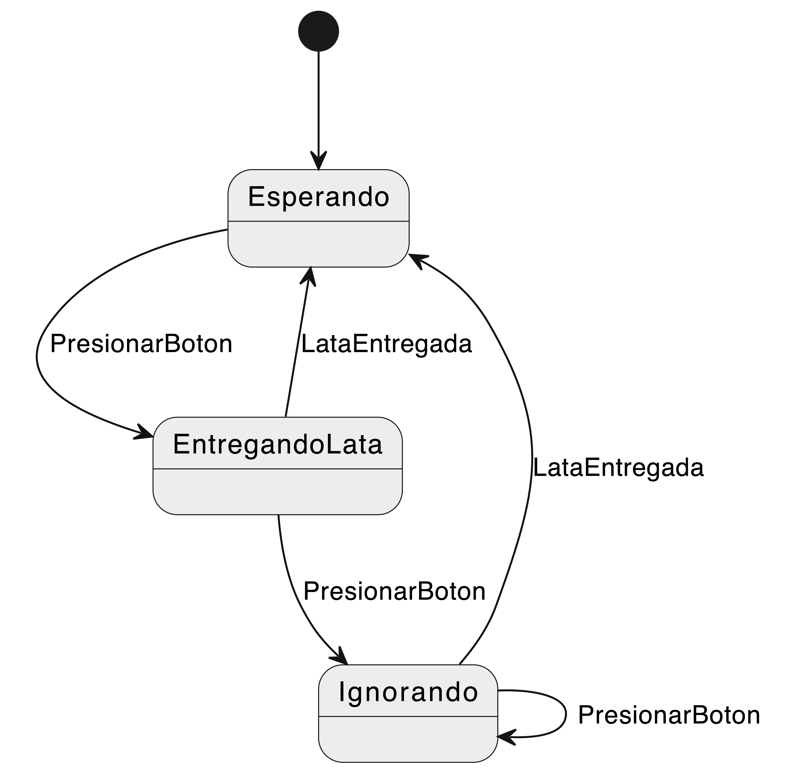

# Taller 1 - DevOps
Este proyecto es una parte integral de la práctica educativa para el curso de DevOps en la Pontificia Universidad Javeriana Cali. Está diseñado para ofrecer a los estudiantes una experiencia práctica en la implementación de conceptos clave de DevOps, como la **idempotencia** y el **hardening**, a través de la configuración y el despliegue de una aplicación de contenido estático utilizando Nginx en una plataforma Ubuntu 22.04.4 live server (arm64).

Los estudiantes utilizarán scripts en Bash para automatizar la instalación de dependencias y la configuración de servidores. Los scripts clave incluyen main.sh, que coordina la ejecución de los demás scripts; `dependencies.sh`, que instala las dependencias necesarias y configura zsh; `nginx-config.sh`, que configura Nginx y prepara el despliegue de un sitio estático; y `additional-hardening.sh`, que implementa medidas adicionales de seguridad del sistema. A través de este proceso, los estudiantes desarrollarán y desplegarán un sitio web estático utilizando tecnologías web fundamentales como HTML, CSS y JavaScript.

El proyecto destaca por su aplicación de prácticas de programación avanzadas y gestión de sistemas, asegurando que los estudiantes adquieran habilidades esenciales en la automatización, la seguridad y la estabilidad de los sistemas operativos Linux, elementos importantes para cualquier profesional en el campo de DevOps.

## Tabla de Contenidos
- [Introducción](#introducción)
- [Requisitos](#requisitos)
  - [Requisitos de Sistema](#requisitos-de-sistema)
  - [Cuentas y Accesos](#cuentas-y-accesos)
  - [Dependencias Externas](#dependencias-externas)
- [Archivos Principales](#archivos-principales)
- [Ejecución del Proyecto](#ejecución-del-proyecto)
  - [Preparativos Iniciales](#preparativos-iniciales)
  - [Ejecución del Script](#ejecución-del-script)
  - [Verificación y Pruebas](#verificación-y-pruebas)
  - [Solución de Problemas](#solución-de-problemas)
  - [Consideraciones de Seguridad](#consideraciones-de-seguridad)
- [Conceptos basicos para entender el desarrollo del proyecto](#conceptos-basicos-para-entender-el-desarrollo-del-proyecto)
  - [Idempotencia](#idempotencia)
    - [Ejemplo de Idempotencia](#ejemplo-de-idempotencia)
    - [Técnicas comunes de Idempotencia](#técnicas-comunes-de-idempotencia)
  - [Hardening](#hardening)
    - [Ejemplo de Hardening](#ejemplo-de-hardening)
    - [Técnicas comunes de Hardening](#técnicas-comunes-de-hardening)
- [Aplicación de Idempotencia en el proyecto](#aplicación-de-idempotencia-en-el-proyecto)
  - [Justificación de la Idempotencia](#justificación-de-la-idempotencia)
  - [Conclusión](#conclusión)
- [Aplicación de Hardening en el proyecto](#aplicación-de-hardening-en-el-proyecto)
- [Creditos](#creditos)
- [Licencia](#licencia)


## Introducción
Este proyecto forma parte de una actividad educativa en el curso de DevOps de la Pontificia Universidad Javeriana Cali, centrada en aplicar y profundizar el entendimiento de los estudiantes sobre conceptos críticos como la **idempotencia** y el **hardening** en la configuración de servidores. Utilizando Ubuntu 22.04.4 live server (arm64) como base y Nginx para desplegar contenido estático, los estudiantes trabajan en scripts de Bash para automatizar y asegurar la configuración del servidor.

El objetivo del proyecto es que los estudiantes desarrollen habilidades prácticas en la creación de entornos seguros y estables mediante la programación de scripts que reflejen principios de idempotencia y técnicas de hardening. Estos scripts no solo preparan el servidor para servir una aplicación web estática, sino que también configuran el entorno de manera que cualquier ejecución subsiguiente del proceso de configuración no altere el estado final del sistema, a menos que sea necesario.

A lo largo de la práctica, se espera que los estudiantes apliquen y consoliden sus conocimientos en la escritura de scripts en Bash, manejo de sistemas operativos Linux, y configuración de servidores web con Nginx. Los scripts, tales como `main.sh`, `dependencies.sh`, `nginx-config.sh`, y el `additional-hardening.sh`, forman una cadena de comandos de configuración para desplegar y mejorar la seguridad de un sitio web. Cada uno cumple funciones específicas desde la instalación de dependencias necesarias, configuración de Nginx, hasta el fortalecimiento adicional de la seguridad del servidor.

El proyecto desafía a los estudiantes a pensar en cómo sus configuraciones pueden afectar la seguridad y la estabilidad del servidor, promoviendo un enfoque consciente y proactivo en la administración de sistemas y la ingeniería de DevOps.

Este Readme.md detalla los pasos necesarios para configurar el proyecto, incluyendo la estructura de los scripts, directivas para la configuración de Nginx y medidas de seguridad aplicadas a través del proceso de hardening. Sirve como una guía comprensiva para asegurar que los estudiantes puedan implementar las prácticas aprendidas de manera efectiva y obtener el máximo beneficio educativo de esta experiencia práctica.


## Requisitos

### Requisitos de Sistema
Para ejecutar y desarrollar este proyecto se necesita:

- **Sistema Operativo**: Ubuntu 22.04.4 live server (arm64). Puede ser instalado en una máquina física, una máquina virtual o un servidor en la nube.
- **Hardware Recomendado**:
  - CPU: Procesador de 64 bits con al menos 2 núcleos.
  - RAM: Mínimo 4 GB.
  - Almacenamiento: Al menos 10 GB de espacio disponible.
- **Software**:
  - Bash shell para la ejecución de scripts.
  - Acceso a Internet para descargar dependencias y actualizaciones.

### Cuentas y Accesos
Dependiendo del entorno en el que se despliegue el proyecto, es posible que se requieran las siguientes cuentas y accesos:

- **Acceso a servidor**: Derechos de administrador (sudo) para la instalación de paquetes y configuración del sistema.
- **GitHub**: Acceso al repositorio de código del proyecto para clonar el código fuente.
- **Credenciales de Cloud (opcional)**: Si se utiliza un servidor en la nube, serán necesarias las credenciales para gestionar instancias y configurar redes.

### Dependencias Externas
El proyecto requiere de las siguientes herramientas y paquetes, que deben ser instalados si no están presentes:

- **Nginx**: Servidor web utilizado para desplegar el sitio estático.
- **Herramientas de red como `net-tools`**.
- **Herramientas de desarrollo como `tree`**: Utilizadas para visualizar la estructura de directorios de forma gráfica.
- **UFW (Uncomplicated Firewall)**: Para la gestión de la seguridad mediante firewall.
- **Librerías de seguridad como libpam-pwquality**: Usadas para fortalecer la política de contraseñas.
- **OpenSSL**: Para la generación de contraseñas seguras.
- **rsyslog**: Para configurar el registro avanzado de eventos del sistema.
- **Zsh y Oh-My-Zsh**: Para una configuración mejorada de la shell de comandos.

Esta sección proporciona una base clara sobre lo que los usuarios necesitan entender lo que se va a instalar en su entorno posterior a la ejecución de los scripts.

## Archivos Principales
El proyecto consta de tres scripts principales:
- **main.sh**: Este es el script principal que coordina todo el proceso de configuración del servidor. Inicia invocando a `dependencies.sh` para asegurar que todas las dependencias necesarias estén instaladas y configuradas, tales como Nginx, `tree`, `OpenSSL`, y `rsyslog`. Luego, llama a `nginx-config.sh` para configurar el servidor web Nginx con medidas de seguridad básicas, ajustar permisos de archivos y directorios, y enlazar la configuración del sitio web al directorio de sitios disponibles de Nginx. Finalmente, ejecuta `additional-hardening.sh` para aplicar medidas de seguridad adicionales como la configuración de políticas de contraseñas y deshabilitar el inicio de sesión de root por SSH. Confirma cuando todos los procesos han terminado.
- **dependencies.sh**: Este script gestiona la instalación y configuración de las dependencias esenciales del sistema. Verifica si Zsh está instalado y, en caso contrario, lo instala junto con Oh-My-Zsh para el usuario root y todos los usuarios en `/home`. Configura Zsh como la shell predeterminada para el usuario root y asegura la instalación de paquetes críticos como `tree`, `net-tools`, `nginx`, `libpam-pwquality`, y `rsyslog`. Este enfoque garantiza que todos los componentes necesarios estén presentes antes de proceder con la configuración del servidor.
- **nginx-config.sh**: Dedicado a la configuración del servidor Nginx. Implementa medidas de seguridad como desactivar los tokens del servidor, crea y ajusta un nuevo archivo de configuración del sitio web, y establece el enlace simbólico necesario para activar el sitio en Nginx. Gestiona configuraciones del firewall UFW para permitir tráfico en los puertos necesarios (80 y 443) y verifica que el firewall esté activado y configurado correctamente. Reinicia Nginx para aplicar todas las configuraciones.
- **additional-hardening.sh**: Este archivo se enfoca en fortalecer la seguridad del servidor a través de varias tácticas. Configura el registro de eventos de seguridad y establece una política de contraseñas seguras mediante la modificación de la configuración de PAM. Además, deshabilita el inicio de sesión root por SSH y crea un nuevo usuario con configuración de Zsh y Oh-My-Zsh, asignándole permisos de administrador y una contraseña segura generada automáticamente.

## Ejecución del Proyecto
En esta sección se detalla cómo preparar y ejecutar el script principal `main.sh`, que automatiza la configuración completa del servidor en Ubuntu 22.04.4 live server (arm64). Sigue los siguientes pasos para asegurar que el entorno esté correctamente configurado y listo para la ejecución.

### Preparativos Iniciales

1. **Obtención del Script**: Descarga el script `main.sh` desde el repositorio de código fuente proporcionado o clónalo directamente utilizando Git:
    ```shell
    git clone [URL del repositorio]
    ```
2. **Permisos de Ejecución**: Antes de ejecutar el script, es necesario otorgar permisos de ejecución. Abre una terminal y navega hasta el directorio donde se encuentra el script. Ejecuta el siguiente comando para modificar los permisos:
    ```shell
    chmod +x main.sh
    ```
### Ejecución del Script

1. **Comando de Ejecución**: Una vez configurados los permisos, ejecuta el script desde la terminal:
    ```shell
    ./main.sh
    ```
Este comando iniciará el proceso de configuración automática, que incluye la instalación de las dependencias necesarias y la configuración de Nginx.

2. **Monitoreo del Proceso**: El script proporcionará actualizaciones en la terminal acerca del progreso de las instalaciones y configuraciones. Observa estos mensajes para asegurarte de que todo se está ejecutando correctamente.

A continuación, puedes ver un GIF que ilustra el proceso de ejecución del script:


### Verificación y Pruebas
1. **Confirmación de Éxito**: Tras la ejecución del script, verifica que el servidor Nginx está funcionando correctamente accediendo a la dirección IP de tu servidor en un navegador web. Deberías ver la página de inicio del sitio web estático configurado.

2. **Pruebas Adicionales**: Asegúrate de que todas las configuraciones de seguridad y operativas estén funcionando como se espera. Por ejemplo, puedes comprobar el estado del firewall con:
    ```shell
    sudo ufw status
    ```

### Solución de Problemas

- Errores Comunes: Si encuentras errores durante la ejecución, revisa los registros de salida que proporciona el script para identificar el problema específico.
- Soporte: Si necesitas ayuda adicional, consulta la sección de FAQ o contacta al soporte técnico utilizando los detalles proporcionados en la sección de contacto.

### Consideraciones de Seguridad
Asegúrate de revisar y modificar cualquier configuración predeterminada que pueda representar un riesgo de seguridad, como contraseñas predeterminadas o configuraciones de red abiertas. Esta mas que todo para maquinas aprovisionadas en nube o en On-premises.

Siguiendo estos pasos, podrás configurar y poner en marcha el servidor de manera segura, aprovechando al máximo el script automatizado `main.sh`.


## Conceptos basicos para entender el desarrollo del proyecto

### Idempotencia
La idempotencia es un concepto esencial en la ingeniería de sistemas y software, que describe la propiedad de ciertas operaciones que pueden realizarse repetidas veces sin alterar el resultado más allá de la primera ejecución. Este principio es importante cuando se busca la estabilidad y confiabilidad en sistemas automatizados porque asegura que los efectos de una operación no se acumulen o se modifiquen con ejecuciones repetidas.

La idempotencia proporciona una garantía fuerte en el desarrollo de software y la administración de sistemas: una vez que una acción deseada se realiza correctamente, realizar la misma acción de nuevo no tiene ningún efecto adicional. Esto es especialmente importante en ambientes donde se necesitan reinstalaciones o actualizaciones automáticas, asegurando que el sistema permanezca en un estado consistente sin importar cuántas veces se ejecute el proceso.

#### Ejemplo de Idempotencia
Imagina que estás frente a una máquina expendedora de refrescos. Cuando presionas el botón para obtener una lata de refresco, la máquina te entrega exactamente una lata, no importa cuántas veces presiones el botón rápidamente. Si presionas el botón cinco veces en rápida sucesión, no recibirás cinco latas, sino sólo una. La máquina está diseñada para ignorar cualquier pulsación adicional mientras está en proceso de entregar la lata.

Este es un ejemplo clásico de idempotencia: el acto de presionar el botón para obtener una lata es una operación que puedes realizar varias veces, pero el resultado no cambia después de la primera entrega exitosa. Aplicado a los sistemas y software, este concepto ayuda a evitar efectos no deseados de acciones repetidas en situaciones donde un solo resultado es suficiente o deseado.

  <p align="center">
    
  </p>

#### Técnicas comunes de Idempotencia

1. **Comprobaciones de Estado Preexistentes**:
Una de las formas más simples y comunes de asegurar la idempotencia es verificar el estado actual del sistema antes de realizar una operación. Por ejemplo, antes de instalar un software, un script puede verificar si ya está instalado. Solo si el software no está presente, el script procederá con la instalación. Esta técnica previene la ejecución innecesaria de operaciones y es ampliamente utilizada en la gestión de configuraciones y scripts de instalación.

2. **Uso de Ficheros de Bloqueo**:
Los ficheros de bloqueo son una técnica usada para prevenir que una operación se ejecute más de una vez al mismo tiempo. Cuando una operación comienza, crea un fichero de bloqueo en el sistema, y otras instancias del mismo proceso verifican la existencia de este fichero antes de proceder. Si el fichero existe, las otras instancias no continuarán, asegurando que la operación no se ejecute múltiples veces de manera simultánea.

3. **Transacciones Atómicas**:
En bases de datos y otros sistemas que soportan transacciones, hacer que las operaciones sean atómicas (todo o nada) asegura que cualquier efecto parcial debido a una operación incompleta no se guarde, manteniendo así la idempotencia. Si una operación que modifica el estado del sistema falla a mitad de camino, el sistema puede revertir a su estado anterior, asegurando que los intentos subsiguientes tengan el mismo contexto de inicio.

4. **Uso de Herramientas y Frameworks de Configuración**:
Herramientas de gestión de configuración como Ansible, Puppet, y Chef están diseñadas para ser idempotentes. Estas herramientas manejan la configuración de infraestructuras asegurándose de que las declaraciones sobre el estado deseado del sistema se apliquen consistentemente sin importar cuántas veces se ejecute la configuración.

5. **Scripts de Rollback**:
Algunas operaciones pueden incluir scripts de rollback que deshacen sus efectos si se detecta que la operación se ha ejecutado previamente o si falla después de haber comenzado. Esto es útil en despliegues de software y actualizaciones de sistemas donde revertir a un estado anterior es mejor que dejar un sistema en un estado inconsistente.

Estas técnicas no solo ayudan a mantener la estabilidad y consistencia en sistemas complejos, sino que también facilitan la automatización y reducen los riesgos asociados con la gestión de cambios y la implementación de software. Utilizarlas adecuadamente puede mejorar significativamente la fiabilidad y la eficiencia de los procesos de TI.


### Hardening
El hardening es un proceso integral y meticuloso en la seguridad de sistemas y redes que implica una serie de estrategias y acciones destinadas a reforzar la seguridad de los sistemas informáticos. Este proceso se enfoca en reducir la superficie de ataque de un sistema, lo cual se refiere a la disminución del número total de puntos a través de los cuales un atacante podría ingresar o infligir daño a un sistema. Al minimizar estos puntos vulnerables, se reduce significativamente la probabilidad de ataques exitosos.

El hardening no es un único paso, sino un conjunto de prácticas y configuraciones que se aplican a diferentes niveles del entorno tecnológico. Esto incluye desde el sistema operativo, pasando por las aplicaciones hasta llegar a la red y los dispositivos periféricos. Cada uno de estos niveles puede ser ajustado y configurado con el objetivo de cerrar brechas de seguridad, desactivar servicios innecesarios, eliminar cuentas de usuario no utilizadas o innecesarias, y aplicar las políticas de seguridad más estrictas y adecuadas para cada situación.

#### Ejemplo de Hardening
Para ilustrar el concepto de hardening, piensa en tu hogar: si quieres asegurarte de que es seguro, no solo cierras las puertas con llave, sino que también aseguras las ventanas, instalas una alarma y tal vez incluso colocas cámaras de seguridad. De la misma manera, en el contexto de la seguridad informática, el hardening puede incluir desde la eliminación de servicios innecesarios y usuarios no autorizados hasta la configuración de firewalls y permisos restrictivos en archivos y carpetas.

<p align="center">
  
</p>


#### Técnicas comunes de Hardening

1. **Actualización Regular de Software**:
Mantener todos los sistemas y aplicaciones actualizados con los últimos parches de seguridad para proteger contra vulnerabilidades conocidas.

2. **Configuración Segura**:
Ajustar las configuraciones predeterminadas de sistemas y aplicaciones, las cuales a menudo están orientadas hacia la facilidad de uso en detrimento de la seguridad. Esto incluye deshabilitar servicios innecesarios y cerrar puertos no utilizados.

3. **Control de Acceso**:
Implementar políticas de control de acceso estrictas, asegurando que solo los usuarios y procesos autorizados tengan los permisos necesarios para realizar operaciones críticas.

4. **Protección de Datos**:
Cifrar los datos almacenados y en tránsito para proteger la información sensible contra interceptaciones y accesos no autorizados.

5. **Seguridad Física**:
Asegurar que el acceso físico a los sistemas críticos esté restringido solo al personal autorizado.

6. **Auditoría y Monitoreo**:
Configurar herramientas de monitoreo y auditoría para detectar y registrar actividades sospechosas o anómalas dentro de la red y los sistemas.

El hardening es, por tanto, una estrategia proactiva de seguridad que requiere un conocimiento profundo de la infraestructura tecnológica, un entendimiento claro de las amenazas potenciales, y una evaluación continua del entorno de seguridad para adaptarse a nuevos desafíos. Es un aspecto fundamental en la protección de cualquier infraestructura digital, y es especialmente crítico en entornos propensos a ataques o donde la seguridad de los datos es de suma importancia.


## Aplicación de Idempotencia en el proyecto

La idempotencia es un principio crítico en la automatización de sistemas que busca garantizar que repetidas ejecuciones de un proceso resulten siempre en el mismo estado final, sin cambios adicionales después de la primera ejecución exitosa. Este enfoque es esencial para mantener la estabilidad y previsibilidad en los entornos de producción y desarrollo.


<p align="center">
  
</p>


### Justificación de la Idempotencia

En nuestro contexto, la idempotencia se justifica claramente a través del comportamiento del script `main.sh`. Cada vez que este script se ejecuta, activa una serie de subprocesos que instalan dependencias, configuran Nginx y aplican medidas de seguridad, independientemente de cuántas veces se haya ejecutado anteriormente. Esto asegura que cada ejecución del script, sin importar su frecuencia, mantiene el sistema consistentemente configurado como después de su primera ejecución exitosa.

Los scripts individuales como `dependencies.sh`, `nginx-config.sh`, y `additional-hardening.sh` incluyen múltiples comprobaciones y condiciones que verifican el estado actual del sistema antes de proceder con cualquier cambio. Por ejemplo, `dependencies.sh` verifica si ciertos paquetes están instalados antes de intentar instalarlos, y `nginx-config.sh` ajusta la configuración de Nginx sólo si es necesario. Estas operaciones condicionales son fundamentales para la implementación de la idempotencia, ya que evitan modificaciones innecesarias y redundantes en el sistema.

### Conclusión

Implementar la idempotencia a través de `main.sh` en nuestro proyecto es una estrategia efectiva que no solo mejora la fiabilidad y previsibilidad de los despliegues, sino que también optimiza los recursos del sistema. Esta metodología es valorada en entornos profesionales de TI y DevOps por su capacidad para asegurar que, una vez que una configuración deseada se ha establecido correctamente, las ejecuciones adicionales del mismo proceso no alterarán ese estado, manteniendo así la integridad y el rendimiento del sistema.

Este enfoque de idempotencia garantiza que, sin importar cuántas veces se ejecute el script `main.sh`, el resultado final es un sistema configurado de manera uniforme y segura, exactamente como se configuró después de su primera ejecución exitosa.


## Aplicación de Hardening en el proyecto

En nuestro proyecto de DevOps, el script nginx-config.sh es un excelente ejemplo de cómo se aplica el hardening en un entorno de servidor real. A continuación, se detallan los pasos específicos tomados para endurecer la configuración del servidor Nginx y el sistema operativo:

1. **Configuración de Seguridad de Nginx**:
   - **Desactivación de Server Tokens**: Se modifica la configuración de Nginx para deshabilitar los server tokens, lo que previene que la versión y otros detalles del servidor se revelen en los encabezados HTTP. Esto dificulta que los atacantes identifiquen posibles vulnerabilidades asociadas con versiones específicas de Nginx.
    ```shell
        sudo sed -i 's/# server_tokens off;/server_tokens off;/' /etc/nginx/nginx.conf
    ```
2. **Gestión de Permisos de Archivos y Directorios**:
   - Se ajustan los permisos de los directorios y archivos en la carpeta `web-site` para garantizar que solo el propietario y el grupo www-data tengan los accesos necesarios. Esto reduce la probabilidad de manipulaciones no autorizadas de los archivos del sitio web.
    ```shell
        find "$WEB_ROOT" -type d -exec sudo chmod 755 {} \;
        find "$WEB_ROOT" -type f -exec sudo chmod 644 {} \;
    ```
3. **Configuración de Firewall con UFW (Uncomplicated Firewall)**:
   - **Activación y Configuración de UFW**: Se verifica el estado del firewall y se activa si está inactivo. Luego se configura para permitir tráfico solo en los puertos necesarios (80 y 443 para HTTP y HTTPS, respectivamente). Esto limita las vías de acceso al servidor, permitiendo solo conexiones legítimas y bloqueando las demás.
    ```shell
        sudo ufw allow 80/tcp comment 'permitir tráfico HTTP para nginx'
        sudo ufw allow 443/tcp comment 'permitir tráfico HTTPS para nginx'
        sudo ufw allow 22/tcp comment 'permitir tráfico para ssh'
        sudo ufw reload
    ```
4. **Aseguramiento de la Configuración de Nginx**:
   - **Configuración del Sitio Web**: Se crea una configuración específica para el sitio que se alojará en Nginx, asegurando que cualquier petición incorrecta resulte en un error 404, lo que ayuda a prevenir la exposición de archivos o directorios no intencionados.
    ```nginx
        server {
            listen 80 default_server;
            server_name _;
            root $WEB_ROOT;
            index index.html;
            location / {
                try_files \$uri \$uri/ =404;
            }
        }
    ```
5. **Hardening Adicional con el Script additional-hardening.sh**:
   - **Configuración del Registro de Eventos de Seguridad**: 
     - Establecimiento del modo de creación de archivos para logs:
      ```shell
          sudo sed -i 's/$FileCreateMode .*/$FileCreateMode 0640/' /etc/rsyslog.conf
      ```
     - Configuración de rsyslog para registrar más información de seguridad:
      ```shell
          echo "auth,authpriv.* /var/log/auth.log" | sudo tee -a /etc/rsyslog.conf
      ```
   - **Establecimiento de una Política de Contraseñas Seguras**: 
     - Configuración de políticas de contraseñas en PAM que exigen una longitud mínima:
      ```shell
          echo "minlen = 12" >> /etc/security/pwquality.conf
      ```
   - **Deshabilitación del Inicio de Sesión Root por SSH**: 
     - Asegurarse de que el archivo de configuración de SSH contiene la directiva adecuada:
      ```shell
          sudo sed -i 's/^PermitRootLogin .*/PermitRootLogin no/' /etc/ssh/sshd_config
      ```
   - **Creación de Usuario con Configuración Segura**: 
     - Creación de un nuevo usuario con permisos de administrador:
      ```shell
          sudo adduser --gecos "" --disabled-password userssh
      ``` 
     - Añadir al usuario al grupo sudo y configurar Zsh y Oh-My-Zsh:
      ```shell
          sudo usermod -aG sudo userssh
          sudo cp -r /root/.oh-my-zsh /home/userssh/
          sudo chown -R userssh:userssh /home/userssh/.oh-my-zsh /home/userssh/.zshrc
          sudo chsh -s /usr/bin/zsh userssh
      ``` 

Estos pasos de hardening no solo aumentan la seguridad del servidor al reducir su superficie de ataque, sino que también aseguran que el entorno sea robusto frente a amenazas potenciales, protegiendo así la integridad y la disponibilidad del servicio web y los datos. Estas prácticas de hardening son importantes en cualquier proyecto de DevOps que pretenda mantener altos estándares de seguridad y operación.


## Creditos

La pagina estatica que se desplego, se tomo de referencia del proyecto [athityakumar](https://github.com/athityakumar/athityakumar.github.io). Gracias a el proyecto fue posible avanzar rapidamente.

## Licencia

Este proyecto está bajo la Licencia MIT. Esta licencia permite el uso, copia, modificación, y distribución del software de manera libre bajo ciertas condiciones que puedes revisar en detalle en el archivo `LICENSE` incluido en el repositorio.

Para más información sobre los términos y condiciones, por favor consulta el archivo `LICENSE`.
